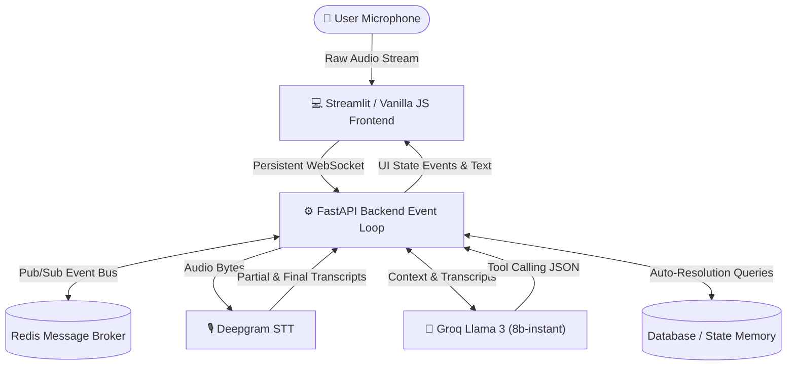

# Healthcare Voice AI Agent

This project is a sophisticated, real-time Voice AI agent built specifically for healthcare applications. It allows patients to converse naturally via voice to book, reschedule, and cancel medical appointments.

The architecture is designed for **ultra-low latency**, **context-aware memory**, and **multilingual support**.

---

## 1. Real-time Voice Architecture & Latency

### System Architecture Diagram


To achieve human-like conversational latency (sub-500ms), the system bypasses traditional HTTP request-response cycles.
* **WebSocket Streaming:** The frontend streams raw microphone audio chunks directly to the FastAPI backend over persistent WebSockets.
* **Deepgram Integration:** Audio is piped in real-time to Deepgram's streaming STT service using a KeepAlive background loop, allowing the AI to generate partial transcripts within 300ms of the user speaking.
* **Event-Driven Bus:** An internal Pub/Sub Event Bus routes Audio bytes, Partial Transcripts, and Final Transcripts asynchronously, preventing I/O blocking.

## 2. Agentic Reasoning & Tool Orchestration
The AI doesn't just chat—it takes actions.
* **Groq Llama 3 (8b-instant):** Powered by Groq's LPUs for hyper-fast inference.
* **Tool Calling Execution:** The LLM is provided with strict JSON schemas for tools (`book_appointment`, `reschedule_appointment`, `cancel_appointment`). 
* **Hallucination Interception:** The backend features a custom Regex parsing fallback layer that seamlessly intercepts and cleans "hallucinated" XML/HTML `<function>` tags generated by the LLM, silently triggering the backend Python tools without breaking the conversational flow.

## 3. Memory Design & Context-Awareness
* **Session Memory:** The LLM maintains a full conversational history dictionary mapped to a unique `session_id`, ensuring it remembers previous symptoms and patient details throughout the call.
* **Context-Aware Tools:** The backend tool orchestration is context-aware. If a user says *"Cancel my appointment"*, the tool dynamically resolves the `appointment_id` by scanning the active session's database memory for the most recently booked slot. This eliminates the need to aggressively prompt the user for an ID they don't know.

## 4. Appointment & Conflict Management
* **Domain Models:** Strict Pydantic models define `Appointment` schemas, enforcing data integrity (Name, Age, Phone, Date, Time, Symptoms, Status).
* **State Management:** Appointments are tracked in a persistent state dictionary.
* **Live UI Sync:** When the AI successfully books or cancels a slot, the backend fires an `appointment_state` event down the WebSocket, dynamically updating the frontend "Appointment Dashboard" box (turning Green for booked, Red for canceled) in real-time.

## 5. Multilingual Handling
Healthcare is diverse, so the agent supports seamless multilingual conversations.
* **Language Selection UI:** Users can select English, Hindi, or Tamil before starting the session.
* **Native Processing:** The language parameter dictates the Deepgram STT model configuration, preventing hallucinations caused by auto-detection on short audio clips.
* **LLM Persona Binding:** The system prompt aggressively enforces the selected language context, forcing the AI to respond natively in Hindi or Tamil without translating mid-sentence.

## 6. Performance Optimisation
* **Hybrid Streamlit Deployment:** The UI is deployed on Streamlit for data dashboard capabilities, but the real-time Vanilla JS/HTML client is wrapped in a secure `components.html` iframe. This bypasses Streamlit's native request-response latency and microphone blocking, allowing the system to maintain true WebSocket streaming inside a Python dashboard.
* **Cache Busting:** Advanced timestamp query injection prevents aggressive browser caching of static JS bundles during real-time deployment updates.

## 7. Code Quality & Structure
* **Separation of Concerns:** The backend is modularised (`app/voice`, `app/llm`, `app/tools`, `app/domain`, `app/events`), adhering to Clean Architecture principles.
* **Asynchronous Design:** 100% async Python (`asyncio`, `fastapi`, `websockets`) ensures the server can handle hundreds of concurrent voice streams without thread-locking.
* **Structured Logging:** `structlog` is implemented across the stack to trace complex LLM decisions and WebSocket disconnects down to the `session_id`.

---

## Setup Instructions

### 1. Environment Variables
Create a `.env` file in the `backend/` directory:
```env
DEEPGRAM_API_KEY=your_deepgram_api_key
GROQ_API_KEY=your_groq_api_key
```

### 2. Running the Backend
```bash
cd backend
docker-compose up -d --build
```

### 3. Running the Dashboard
```bash
pip install streamlit
streamlit run streamlit_app/app.py
```
