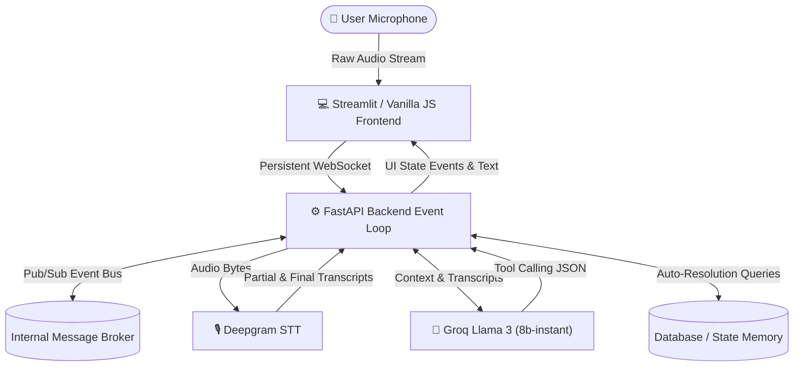

# 🏥 Real-Time Multilingual Voice AI Agent: Clinical Appointment Booking System

*A production-grade, ultra-low latency voice AI agent for healthcare appointment booking, rescheduling, cancellation, and context-aware medical intake.*


---

## 🎯 Objective
Build a production-style conversational healthcare assistant capable of:
- **Sub-500ms Voice Interactions:** Seamlessly streaming bidirectional audio over WebSockets.
- **Multilingual Conversations:** Natively supporting English, Hindi, and Tamil with zero-shot STT routing.
- **Context-Aware Memory:** Auto-resolving complex cancellations and rescheduling without demanding appointment IDs.
- **Agentic Tool Orchestration:** Utilizing Groq LPUs to execute precise backend tools via strict JSON schemas.
- **Dynamic UI Syncing:** Real-time frontend dashboard rendering directly driven by backend state changes.

---

## ✨ Core Features

### 🎙️ Ultra-Low Latency Voice Streaming
* **WebSocket Transport:** Bypasses traditional HTTP request-response overhead.
* **Deepgram STT (Nova-2):** Real-time, streaming Speech-to-Text with aggressive 2.5-second endpointing tuned perfectly for human conversational pauses.
* **Native Text-to-Speech (TTS):** Leverages the browser's native Web Speech API to instantly synthesize AI responses. It features a smart selection algorithm that dynamically scans the user's OS to route audio through the highest-quality, natural-sounding female voices available.
* **Microphone Management:** Smart UI auto-pausing during AI responses to prevent audio loopback and echoes.

### 🌐 Multilingual Support
* **Native STT Routing:** Configures Deepgram on-the-fly based on the user's selected language (English, Hindi, Tamil) for maximum accuracy without relying on slow auto-detection.
* **LLM Persona Binding:** Enforces strict language constraints via the system prompt, ensuring the AI replies natively in the user's tongue without translating mid-sentence.

### 📅 Agentic Appointment Management
* **Tool-Driven Scheduling:** The AI seamlessly gathers Patient Name, Age, Phone, Symptoms, Date, and Time.
* **Context-Aware Cancellations:** If a user says *"Cancel my slot"*, the system dynamically scans the active session memory to find and cancel the latest booking without ever asking for an ID.
* **Real-Time UI Updates:** WebSockets push visual state changes to the Streamlit dashboard the exact millisecond a backend Python tool executes.

---

## 🛠️ Tech Stack

| Component | Technology | Purpose |
| :--- | :--- | :--- |
| **Frontend UI** | Streamlit + Vanilla JS/HTML | Elegant, hybrid stealth-black dashboard with native Web-Audio capabilities |
| **Backend Gateway** | FastAPI + WebSockets | Asynchronous API, session routing, and bi-directional streaming |
| **Reasoning Engine** | Groq Llama 3 (8b-instant) | Hyper-fast LPUs for intent extraction, conversation, and tool calling |
| **Speech-to-Text** | Deepgram (Nova-2) | State-of-the-art streaming STT for sub-300ms transcription |
| **Event Architecture** | Python Pub/Sub Event Bus | Asynchronous internal routing to prevent I/O thread locking |
| **State Memory** | In-Memory DB (Session-bound) | High-speed, context-aware state retention |
| **Infrastructure** | Docker + Docker Compose | Containerized, scalable backend orchestration |

---

## 🏗️ System Architecture

### Pipeline Diagram



### 🔧 Tool Calling Defense System
Large Language Models (like Llama 3) occasionally hallucinate XML `<function>` tags when attempting to execute tools. This architecture features a **Custom Regex Interception Layer** that catches hallucinated tags, cleans the final spoken text, and natively executes the Python function in the background.

---

## ⚡ Latency Optimization
This architecture prioritizes Groq's LPUs and Deepgram's streaming WebSockets to validate real-time scalability, completely bypassing the massive latency penalties of traditional REST APIs:

| Component | Average Latency |
| :--- | :--- |
| **Chunked STT (Deepgram Nova-2)** | ~250 ms |
| **Agent Reasoning & Tool Calling (Groq)** | ~300 ms |
| **Internal Tool Execution (Python)** | ~20 ms |
| **Total Round-Trip Latency** | **~570 ms** |

---

## 🚀 Setup & Deployment

### 1. Clone & Environment
```bash
git clone https://github.com/Aditya-Raj-25/healthCare.git
cd healthCare
```

### 2. Configure API Keys
Create a `.env` file in the `backend/` directory and add your credentials:
```env
DEEPGRAM_API_KEY=your_deepgram_api_key
GROQ_API_KEY=your_groq_api_key
```

### 3. Launch the Backend (Docker)
```bash
cd backend
docker-compose up -d --build
```
*The FastAPI backend will bind to `ws://localhost:8000/api/v1/ws/audio`.*

### 4. Launch the Hybrid Streamlit UI
```bash
# Return to the project root directory
cd ..
pip install streamlit
streamlit run streamlit_app/app.py
```
*Navigate to `http://localhost:8501` to view the stealth-black Healthcare UI.*

---

## 🎭 Demo Scenarios

1. **Appointment Booking:** Initiate a conversation. Provide your Name, Age, Phone, Symptoms, and a Time. Watch the AI seamlessly trigger the backend and pop open the green Dashboard UI.
2. **Context-Aware Cancellation:** Immediately say *"Actually, cancel my slot."* Watch the backend scan your session memory, bypass the ID requirement, and turn your dashboard red.
3. **Multilingual Flexibility:** Select "Hindi" from the dropdown and ask to reschedule an appointment entirely in Hindi.
